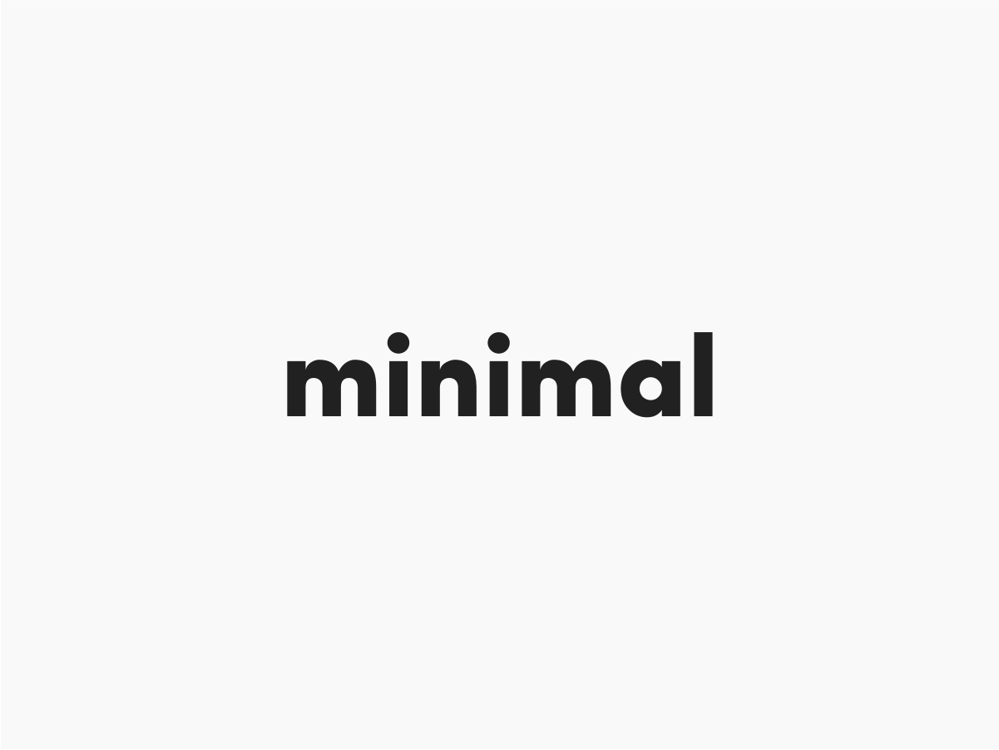

# Minimal UI

**Minimal UI** is boilerplate WordPress theme with a very simple styling. It uses Webpack for processing JS allowing you to use ES6 features such as arrow functions, spread operator, classes, modules, etc. It is also configured with SASS/SCSS support.

## How to use

- Clone this repo into your `/wp-content/themes` directory and activate the theme.

### For development

- Run `yarn` to install dependencies.
- For development mode use `yarn dev`, for production ready code run `yarn build`.

This is an Open Source project, **PRs are open.**
